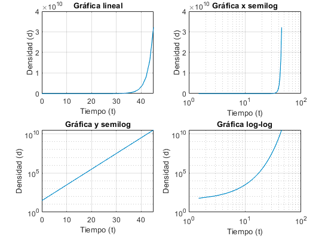

# Proyecto Final, MATLAB BÁSICO

## Objetivos de aprendizaje
- Aplicar nuevas habilidades a un problema del mundo real
- Sintetizar las técnicas aprendidas

## Herramientas
- git
- github
- MATLAB 2019+
- slack


## Organización de carpetas
> TODO: Actualizar, revisar uso de comando [tree](https://stackoverflow.com/questions/23989232/is-there-a-way-to-represent-a-directory-tree-in-a-github-readme-md) y [documento](https://github.com/kriasoft/Folder-Structure-Conventions/blob/master/README.md) de referencia


```
├── main.mlx o main.m       # Archivo principal
├── src                     # Archivos fuentes
│   ├── filter_data.m       # Pre proceso de datos
│   ├── ...                 # ... 
│   └── ...                 # ...
├── data                    # Datos
│   ├── estaciones2022.csv  # Datos de estaciones
│   ├── ....                # ...
│   └──                     # ...
└── out                    # Archivos de salida
└── ...

```

## Descripción
> TODO: Actualizar

SMARTSEC Node es una aplicación desarrollada en Python que procesa información
de audio y vídeo para realizar el reconocimiento de asaltos con armas de fuego en tiempo real. Cuando un asalto es detectado, se genera una foto del momento y una grabación de vídeo de 10 segundos, 5 segundos antes y 5 después de la detección. Mediante Wi-Fi, se envía la información de la imagen, vídeo y fecha hacia la plataforma SMARTSEC Monitor.

### Fuente de datos
> TODO: Detallar la fuente de datos utilizada. Agregar URLs.

A continuación se muestra el funcionamiento de la aplicación. 

> TODO: Actualizar captura y enlace  a video en youtube
<div align="center">
<a href="https://www.youtube.com/watch?v=msJjpZxu6tY&ab_channel=MATLABenEspa%C3%B1ol" target="_blank">

</a>
<p>Demostración de funcionamiento</p>
</div>

<br/><br/>


## Versiones y evoluciones del producto
> TODO: Completar

Versión 1.0 Febrero 2022

- Permite visualizar casos positivos y muertes
- Procesa datos desde un archivo csv
- ....  
